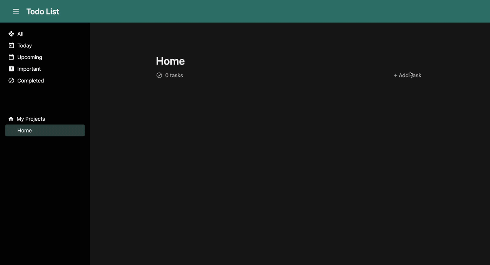

# Todo-List

A Todoist clone built with with plain HTML, CSS, and JavaScript.

Try it out here! -> https://amormio25.github.io/todo-list/

## Features

- **Task Management**: Add, update, and delete tasks with ease.
- **Project Organization**: Group tasks into projects for better organization.
- **Dynamic Interface**: Real-time updates to the task list and project view.
- **Responsive Design**: Fully functional across devices of all screen sizes.
- **Custom Dialogs**: Intuitive modal dialogs for creating and editing tasks and projects.
- **Interactive Calendar**: Select due dates using a built-in calendar component.
- **Priority Levels**: Assign priority levels to tasks for better focus.

## Acknowledgements

- Project by The Odin Project
- Inspired by project submissions to The Odin Project and Todoist
